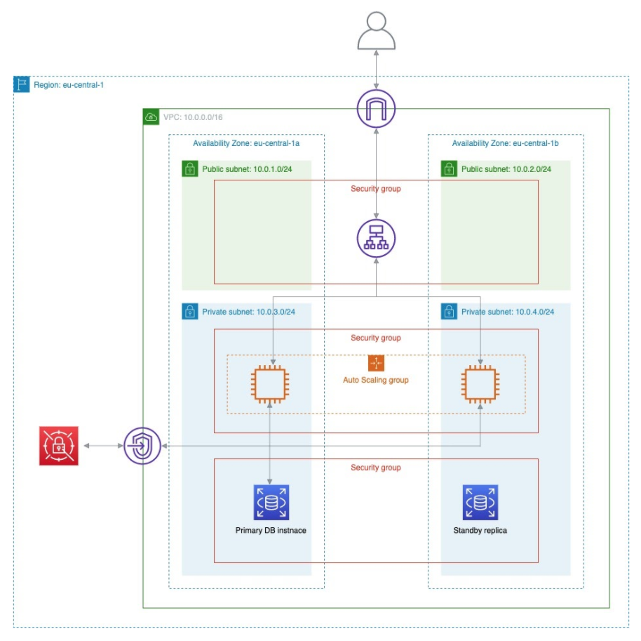

# Introduction

## Amazon Web Services

### AWS Free Tier

AWS allows to explore more than 100 products and start building on AWS using the Free Tier. You can check the details [here](https://aws.amazon.com/free). Using AWS Free Tier, we will use:

* Amazon EC2 - **750 hours** per month of Linux **t2.micro**
* Amazon RDS - **750 hours** per month of PostgreSQL **db.t2.micro** database usage and **20 GB** of General Purpose (SSD) database storage
* Amazon Elastic Block Storage - **30GB** any combination of General Purpose (SSD) or Magnetic, **1 GB** of snapshot storage

### Services not covered by the Free Tier

Charges that you may incur because of these workshops should not exceed **1$**. You may be charged because of the following services we will use:

* Application Load Balancer
* CloudWatch
* VPC Endpoint
* Secrets Manager
* EBS (snapshots)

**We will destroy all resources at the end of the workshops.**

### The infrastructure we will build

consists of:

* Virtual Private Cloud with:
  * 4 subnets (2 public and 2 private)
  * Internet Gateway
  * 2 Route Tables
  * VPC Endpoint
* Application Load Balancer
* Auto Scaling Group
* Relational Database Service
* Security Groups
* IAM Role

We will use the AWS Secrets Manager service to store credentials for the database. Also, we will build our own Amazon Machine Image that contains Node.js application code. The image will be used by Auto Scaling Group to spin up EC2 instances.

## Terraform

An open source tool created by HashiCorp that allows you to define your infrastructure as code using a declarative language and deploy it in the cloud.

## Packer

An open source tool for creating identical machine images for multiple platforms from a single source configuration, also created by HashiCorp.

